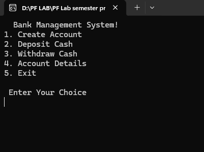
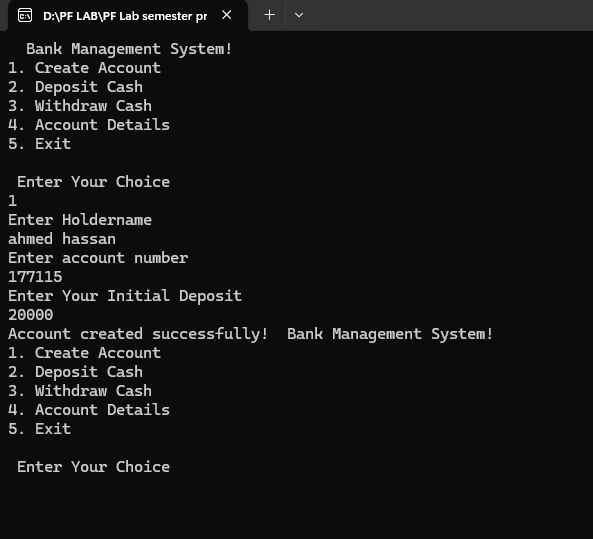
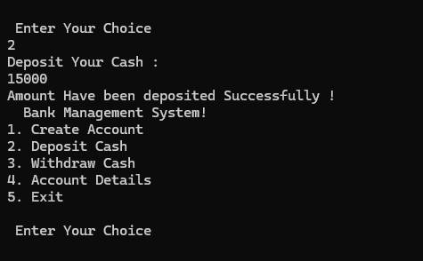
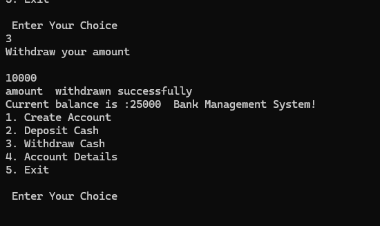
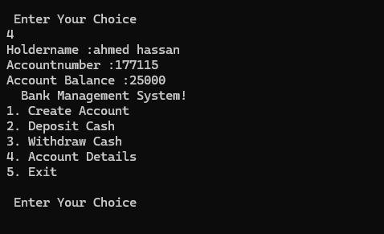

# Bank Management System 🏦

## 📌 Overview
The Bank Management System is a C++ console-based application developed to simulate basic banking operations such as account creation, cash deposit, cash withdrawal, and account detail management.

The system allows users to create a bank account, manage their balance, and view account details through a simple menu-driven interface.

This project was built to practice Object-Oriented Programming concepts, structured programming, and basic system design using C++.

---

## ✨ Features

### 👤 Create Account
- Create a new bank account
- Enter account holder name
- Assign account number
- Set initial deposit balance

### 💵 Deposit Cash
- Deposit money into the account
- Automatically updates account balance

### 💸 Withdraw Cash
- Withdraw money from the account
- Validates balance before withdrawal
- Prevents invalid withdrawal attempts

### 📄 Account Details
- Display account holder information
- Show account number
- View current account balance

### 🧠 Concepts Used
- Structures (`struct`)
- Functions with reference parameters
- Conditional statements
- Menu-driven programming
- Input validation
- Console-based interaction

---

## 🛠️ Tech Stack
- C++
- Object-Oriented Programming Concepts
- Structured Programming
- Console-Based System Design

---

## 📸 Screenshots

### 🏠 Main Menu


### 👤 Create Account


### 💵 Deposit Cash


### 💸 Withdraw Cash


### 📄 Account Details


### Exit the System


## 🚀 How to Run

1. Clone this repository  
2. Open the project in any C++ IDE (CodeBlocks, Dev-C++, Visual Studio, or VS Code)  
3. Compile the code using a C++ compiler  
4. Run the executable file

Example:
g++ main.cpp -o bankmanagement
./bankmanagement

📌 Purpose
This project was developed to strengthen understanding of C++ programming, function handling, data management using structures, and basic banking system simulation.
It helped improve problem-solving skills and practical implementation of real-world operations like deposits, withdrawals, and account management.
```bash
g++ main.cpp -o bankmanagement
./bankmanagement
